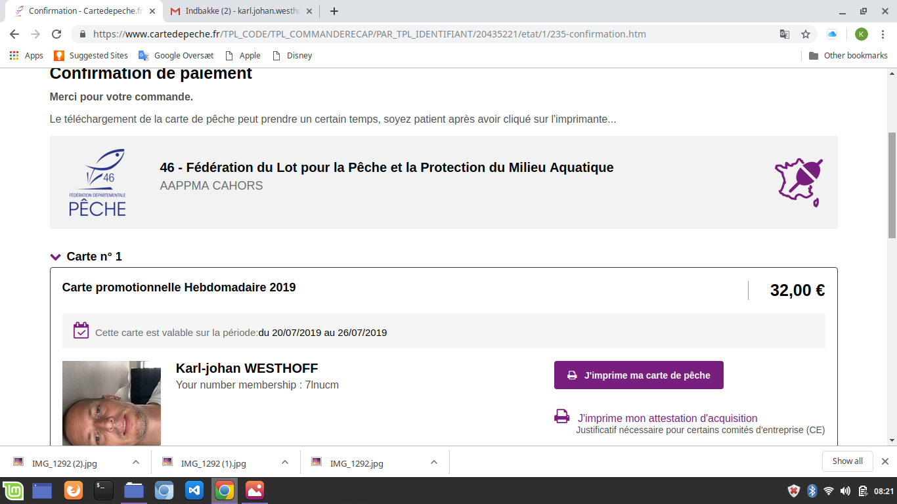

# List of changes
## As i went along with the starter code

## Look at the starter page as is
1. The title says "website" in the tab
    - Fixed
1. The "Search Engine optimisation link in the header does not work     
    - id mssing in section with search angine - and tags changed from div to sections etc.
1. Try the "Accecibility experince of the page - could't find out how to after googling decided to do a "ligthhouse" audit with google dev tools it scored a 72% - To be improved
 see:  The report shows missing [alt attributes]
    - alt attributes addeed to the img tags where relevant
    - empty alt tags added to icons
 1. Look at the html
    1. Change div's to someting describing
        - Header changed to header, footer changed to footer and section and article tags applied for various content

