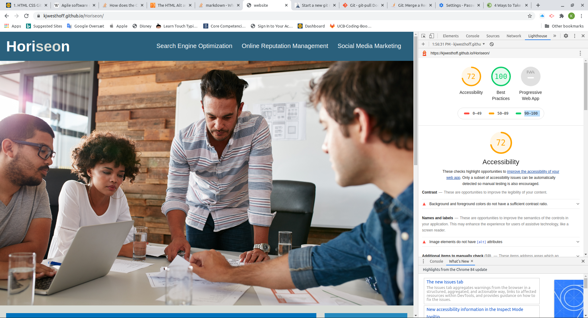
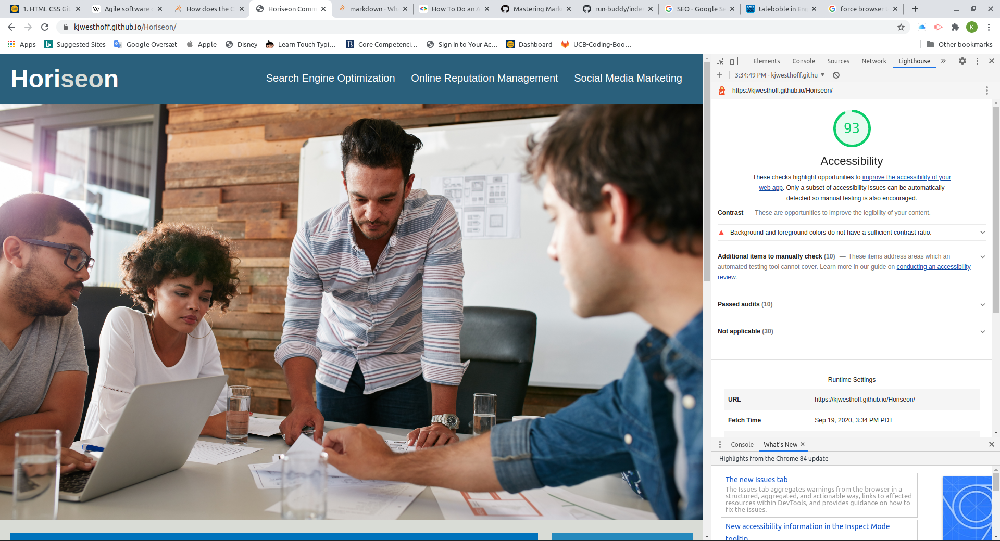

# List of changes
## As i went along with the starter code

## Look at the starter page as is
1. The title says "website" in the tab
    - Fixed
1. The "Search Engine optimisation link in the header does not work     
    - id mssing in section with search angine - and tags changed from div to sections etc.
1. Try the "Accecibility experince of the page - could't find out how to after googling decided to do a "ligthhouse" audit with google dev tools it scored a 72% - To be improved
 see:  The report shows missing [alt attributes]
    - alt attributes addeed to the img tags where relevant
    - empty alt tags added to icons
    - now looks like 
    - Lighthouse also ad a comment regarding coloe contrast - no action for now

 1. Look at the html
    1. Change div's to someting describing the section better
        - Header changed to header, footer changed to footer and section and article tags applied for various content
    1. Notced that the Id and class attibutes have the same value . - Googled it found it was ok but "poor form" letting it be for now otherwise the plan is to change the id's (all the CSS are class referenced)
1.  Look at the CSS

