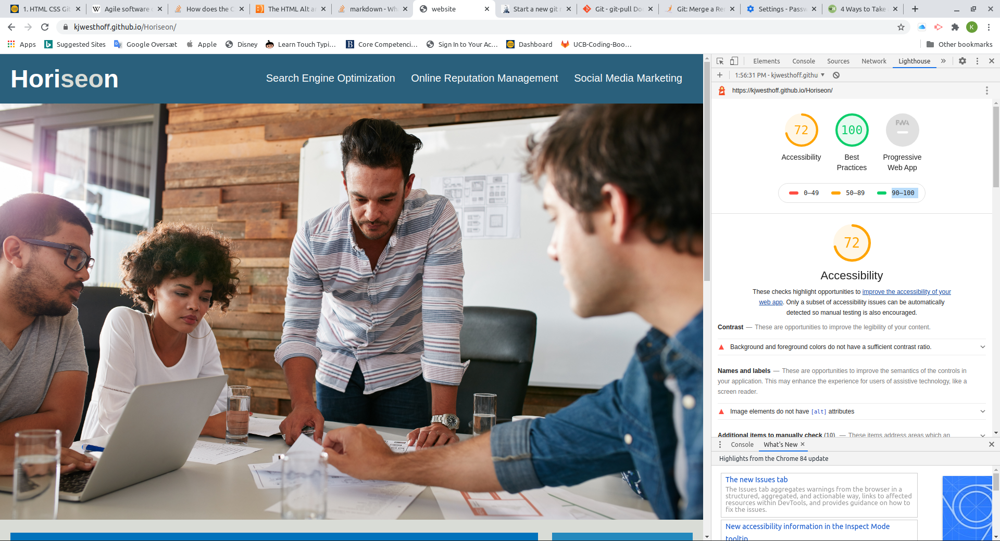
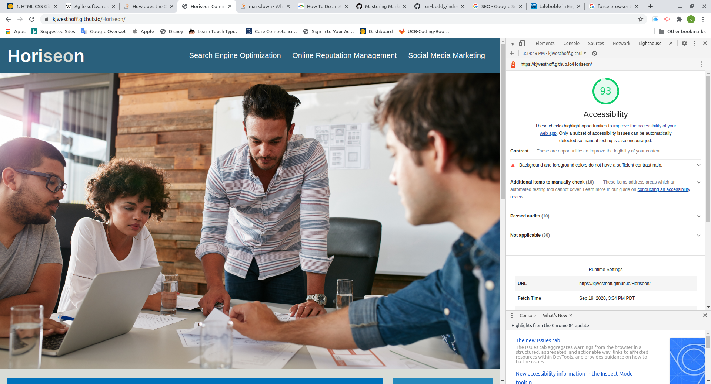

# Horiseon Landing Page

## Main entry for the Horiseon digital communications bureau
### Find all about who we are and our competences

## Page changelog:
# List of changes
## As i went along with the starter code

## Look at the starter page as is
1. The title says "website" in the tab:
    - Fixed
1. Formatted the html file in vs code
1. The "Search Engine optimisation link in the header does not work     
    - id missing in section with search angine - and tags changed from div to sections etc.
1. Try the "Accecibility experince of the page: - could't find out how to after googling found out to do a "ligthhouse" audit with google dev tools it scored a 72% - To be improved
 see:  The report shows missing [alt attributes]
    - alt attributes addeed to the img tags where relevant
    - empty alt tags added to icons
    - now looks like 
    - Lighthouse also ad a comment regarding color contrast - no action for now (shoud be discussed with the design team)

 1. Look at the html:
    1. Change div's to someting describing the section better
        - Header changed to header, nav instead of div in the header footer changed to footer and section and article tags applied for various content
    1. Notced that the id and class attibutes have the same value . - Googled it found it was ok but "poor form" letting it be for now otherwise the plan is to change the id's (all the CSS are class referenced for now)
1.  Look at the CSS:
    1. No commentting at all
        - Fixed
    1. Error in header font family '' added around 'Calibri'
        - Fixed
    1. Only class references used - id's should be used for styling applied to single elements and general elements such as head and footer dont need class references
        -   Changed in the "seo" part of the title
        -   etc ..
        -   class removed from header and footer, also in the html part (risky if they are referenced in other places)
    1. The order of entries changed to match the html better
        - there were some general styling og a and p elements - moved to the beginning 
    1. Lots of repetition in the "benefits section" and "contents section"
        - Order re-done, un-used class references kept in html (if someone else is using them) 
        - code reused, it had a higher level benefits class which is referenced
        - code reused, it had a higher level contents class which is referenced
        

